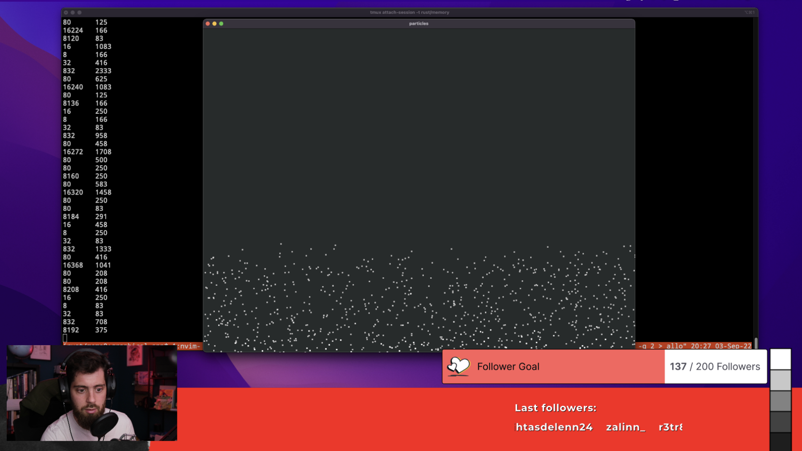

# Particles Generator

This is a graphical application, which generate randome particles within a window.

The data that represents each particles is stored in the HEAP (`Box`).

The purpose of this exercice is to measure the allocation time.

## Run

```text
cargo run -q 2> alloc.txt
```

## Output



The code cotains a custom allocator which produce metrics regarding allocation time.

After running the script you should see a `alloc.txt` file which contains two columns:
* bytes allocates
* nano seconds
